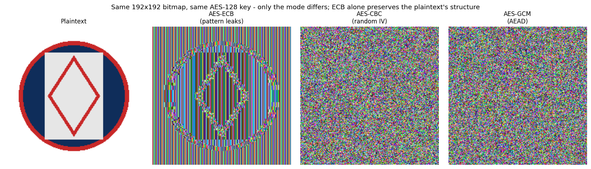

# AES-ECB mode is unsafe

Electronic Codebook (ECB) is a block cipher mode that encrypts every block independently under the same key, with no randomization and no dependency between blocks. That one property — determinism — combined with a second: no integrity check and no chaining between blocks, is enough to break confidentiality outright. ECB fails the standard IND-CPA security definition with an adversary advantage of 1, regardless of key size or key strength.

**[Read the full write-up →](docs/ecb-mode-unsafe.md)** — the formal break, all four attack vectors below, real-world evidence for each, detection techniques, and the fix.

## Two root causes, four attack vectors

Every vector below is a direct consequence of one or both root causes — there is no third.

| Vector | Root cause | What happens | Shown via |
| --- | --- | --- | --- |
| **1. Pattern & structure leakage** | Determinism, passive | Identical plaintext blocks become identical ciphertext blocks; structure survives encryption | Zoom ([CVE-2020-11500](https://nvd.nist.gov/vuln/detail/CVE-2020-11500)), Microsoft Office 365 Message Encryption — real breaches |
| **2. Equality & frequency inference** | Determinism, passive/statistical | Cluster or correlate records by matching ciphertext — no decryption needed | Adobe's 2013 password breach, ~153M records |
| **3. Chosen-plaintext byte-at-a-time recovery** | Determinism, active oracle | Recover a secret the target appends to attacker input, one byte at a time, from ciphertext alone | Cryptopals Set 2 Ch.12 — reproduced live in the notebook |
| **4. Block malleability / cut-and-paste** | No integrity, active splice | Splice a chosen ciphertext block into a legitimate token to forge a privileged role | Cryptopals Set 2 Ch.13 — reproduced live in the notebook |

A fifth data point isn't a specific exploit but shows the scale of the problem: a 2013 study of 11,748 Android apps found "do not use ECB" was the single most-violated cryptographic rule, affecting 7,656 apps — most of them because a library silently defaulted to ECB when the developer under-specified the cipher.

## See it happen

The second panel isn't a rendering artifact — it's the actual AES-ECB ciphertext of the image on the left. CBC (random IV) and GCM (AEAD), encrypted under the same key, produce uniform noise from the same plaintext.

## Run it yourself

[`notebooks/ecb_mode_deep_dive.ipynb`](notebooks/ecb_mode_deep_dive.ipynb) runs every vector above against a real AES-ECB oracle, with real captured output — nothing in it is a claim without code behind it. Open it in [Google Colab](https://colab.research.google.com/) and run all cells top to bottom; the setup cell detects Colab, clones this repository, and installs everything it needs automatically. No local Python setup required.

## Detecting ECB mode

Two independent checks — full detail in the write-up:

- **Black-box** (ciphertext or oracle access only): split ciphertext into fixed-size blocks and look for duplicates. No key, no source access.
- **White-box** (source/config review): ECB is frequently a library default, not a deliberate choice. Grep for `MODE_ECB`, `modes.ECB(`, `/ECB/`, or an unqualified `Cipher.getInstance("AES")` — the single highest-yield check, responsible for three of the real-world instances cited in the write-up.

## Repository structure

- [`docs/ecb-mode-unsafe.md`](docs/ecb-mode-unsafe.md) — the full write-up: mechanism, formal proof, all four vectors, real-world evidence, detection, and the defensive fix.
- [`notebooks/ecb_mode_deep_dive.ipynb`](notebooks/ecb_mode_deep_dive.ipynb) — the runnable companion notebook.
- [`src/ecb_lab/`](src/ecb_lab/) — the tested implementation backing Vectors 1, 3, and 4 (Vector 2's equality-inference demo lives directly in the notebook).
- [`tests/`](tests/) — pytest coverage for every module above, exercised against real AES.
