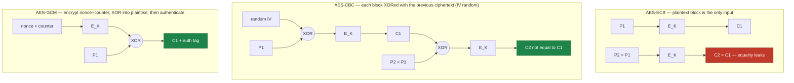
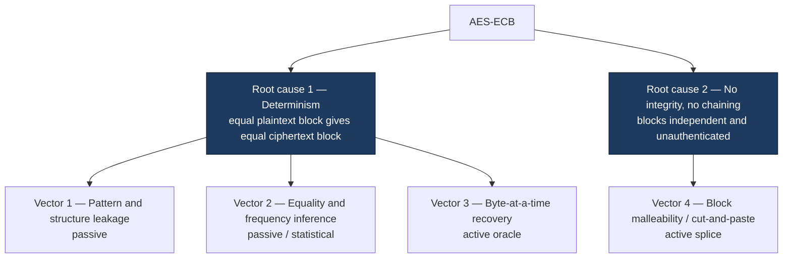
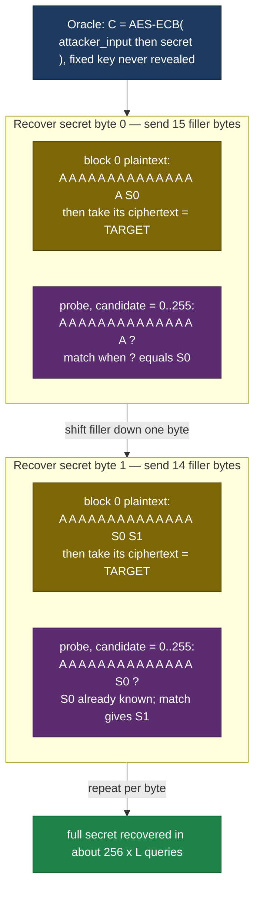
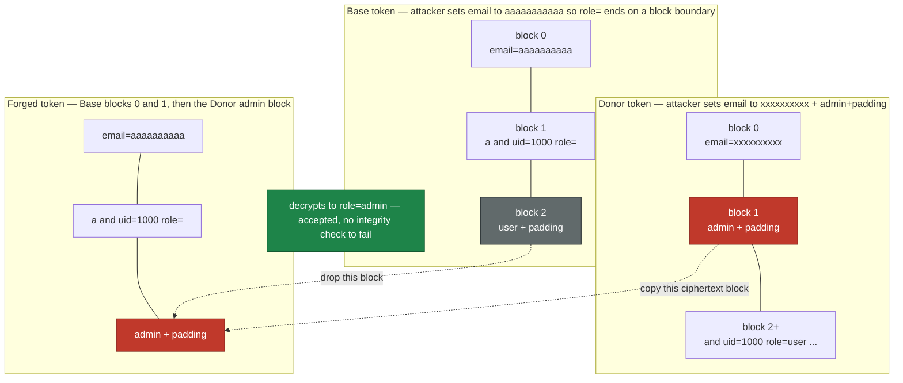

# Why AES-ECB mode is unsafe

## The mechanism, in one paragraph

Electronic Codebook (ECB) is the simplest block cipher mode of operation. A message is split into fixed-size blocks — 16 bytes for AES — and each block is encrypted independently under the same key, with no initialization vector, no nonce, and no dependency on any other block:

$$C_i = E_K(P_i)$$

NIST formally defines ECB in [SP 800-38A](https://csrc.nist.gov/pubs/sp/800/38/a/final) and states plainly what follows from that formula: because each block is encrypted the same way every time, inspecting any two ciphertext blocks reveals whether the corresponding plaintext blocks were equal. ECB behaves like a fixed lookup table — literally a codebook — which is where the name comes from.

The difference from a safe mode is entirely in what feeds each block encryption. ECB feeds it the plaintext block alone, so two equal plaintext blocks take the same path to the same ciphertext. CBC first XORs each plaintext block with the previous ciphertext block (and the first with a random IV); GCM never encrypts the plaintext directly at all — it encrypts a per-message nonce-plus-counter and XORs the result into the plaintext, then authenticates. Both break the equal-in/equal-out path that ECB leaves open.

That single property, determinism, plus one more — ECB blocks are independent and carry no authentication — is the root of every attack in this document. There is no third root cause; every vector below is a direct consequence of one or both.

**Scope note.** ECB's determinism is only harmless in the narrow case of a single block of unpredictable data that is never repeated under the same key — there is no second ciphertext block for the equal-plaintext/equal-ciphertext property to leak through. SP 800-38A does not carve out this exception itself; it is a direct consequence of the property the standard does state. Everything in this document concerns multi-block or repeated data, where ECB's determinism has somewhere to leak.

## Why determinism breaks confidentiality

A block cipher mode should be indistinguishable under chosen-plaintext attack (IND-CPA): an adversary who submits two equal-length messages and receives the encryption of one of them, chosen at random, should not be able to guess which one better than a coin flip. ECB fails this outright.

Consider an adversary who submits two 32-byte (2-block) messages:

- $M_0 = \texttt{"AAAAAAAAAAAAAAAA"} \parallel \texttt{"AAAAAAAAAAAAAAAA"}$ — two identical blocks
- $M_1 = \texttt{"AAAAAAAAAAAAAAAA"} \parallel \texttt{"BBBBBBBBBBBBBBBB"}$ — two distinct blocks

The challenger encrypts one of them and returns $C = C_1 \parallel C_2$. The adversary answers "$M_0$" if $C_1 = C_2$, else "$M_1$" — and is right every time, because ECB's determinism means $C_1 = C_2$ exactly when $P_1 = P_2$. The adversary's advantage is 1, the maximum possible. This is not a probabilistic weakness or a matter of key size: a stronger key does not change this proof, because the break is in the mode, not the underlying cipher.

## Comprehensive attack surface

Two root causes, four vectors. Positional variants (an oracle that appends vs. prepends the secret; splicing vs. reordering vs. truncating ciphertext) are the same underlying technique and are grouped together rather than listed as separate top-level threats.

Every vector traces back to one of the two root causes and to no third — determinism drives the three confidentiality attacks, the missing integrity drives the one tampering attack:

### Vector 1 — Pattern and structure leakage (determinism, passive)

Identical plaintext regions become identical ciphertext regions. Uniform image backgrounds, repeated record layouts, and fixed protocol headers all survive encryption as visible structure. Ciphertext length also leaks plaintext length, rounded up to the block size.

The outline in the second panel is not a rendering artifact — it is the actual AES-ECB ciphertext of the image on the left, generated and verified in [`notebooks/ecb_mode_deep_dive.ipynb`](../notebooks/ecb_mode_deep_dive.ipynb). CBC (random IV) and GCM (AEAD) produce uniform noise from the same plaintext under the same key.

### Vector 2 — Equality and frequency inference (determinism, passive/statistical)

Determinism preserves equality across every row of a dataset encrypted under the same key: two ciphertext blocks are equal if and only if the underlying plaintext blocks were equal. This single property enables:

- **Duplicate detection without decryption** — cluster records by identical ciphertext (the Adobe case below).
- **Codebook harvesting** on low-entropy fields — for a small domain (a status flag, a two-digit code), an attacker can precompute every possible plaintext's ciphertext and then read the table backwards.
- **Cross-dataset correlation** — records encrypted under the same key in two different systems can be joined on equal ciphertext, deanonymizing one dataset using the other.
- **Frequency/rank matching** against a public distribution, when categories are frequent enough to be distinguishable from each other by count alone.

### Vector 3 — Chosen-plaintext byte-at-a-time recovery (determinism, active oracle)

When a service computes $\text{AES-ECB}(\text{attacker\_input} \parallel \text{secret}, K)$ — for example, an endpoint that appends a session token to whatever the caller submits before encrypting — an attacker who can align one unknown byte to a block boundary can brute-force all 256 candidates for that byte by comparing ciphertext blocks, then repeat for the next byte. The full secret is recoverable in roughly $256 \times L$ oracle queries, for a secret of length $L$, without the key. This is Cryptopals Set 2 Challenge 12; the harder unknown-prefix variant (Challenge 14) needs an extra alignment step this document does not implement.

The mechanism is easier to see as block layout. The attacker sends just enough filler to leave exactly one unknown secret byte in the last position of a block, captures that ciphertext block as the target, then encrypts all 256 possible values of that byte in the same aligned position until one ciphertext block matches. Recovering the next byte shifts the filler down by one so the already-known bytes plus one new unknown fill the block. Diagram uses a 16-byte AES block; `A` is attacker filler, `S0, S1, …` are secret bytes, `?` is the unknown byte under test.

*Scope: run against a local demonstration oracle only (`ecb_lab.oracle_attack.make_suffix_oracle`), never a third-party service.*

### Vector 4 — Block malleability and tampering (no integrity, active splice)

With no authentication tag and no chaining, ciphertext blocks are independent, portable units. An attacker who can get any chosen plaintext encrypted under the target key (for example, by controlling their own account's email field) can splice a block that decrypts to `role=admin` onto an otherwise legitimate token, and the server accepts it — no decryption error, no signature to forge. The same lack of integrity permits reordering, truncating, duplicating (replay), or transplanting blocks across two services that share a key. This is Cryptopals Set 2 Challenge 13.

The splice works because the attacker controls the email field and can push the pieces onto 16-byte block boundaries. One crafted email isolates an `admin` + padding block; a second aligns the token so the trailing `role=user` block can be dropped and replaced. No key is ever needed — only the public `issue_token` interface. The `role=user` profile string below is exactly what `ecb_lab.cut_and_paste.ProfileService` builds.

*Scope: `ProfileService` is a self-contained local stand-in; the target key stays in-process and no external system is involved.*

## Real-world evidence

Every case below was independently verified against a primary or first-party source — not inherited from a secondary summary.

| Case | What happened | Vector |
| --- | --- | --- |
| **Adobe, 2013** | Roughly 153 million password records were encrypted (not hashed) in ECB mode with what researchers identified as 3DES — inferred from the 8-byte block size, not confirmed by Adobe — without a per-user salt. Identical passwords produced byte-identical ciphertext; researchers clustered accounts by matching ciphertext and used Adobe's own leaked password hints to confirm the most common values within hours. | Vector 2 |
| **Zoom, 2020 ([CVE-2020-11500](https://nvd.nist.gov/vuln/detail/CVE-2020-11500), [Citizen Lab](https://citizenlab.ca/2020/04/move-fast-roll-your-own-crypto-a-quick-look-at-the-confidentiality-of-zoom-meetings/))** | Every meeting used one AES-128 key in ECB mode for all audio/video, preserving structure in the stream — and it was AES-128, not the AES-256 Zoom's marketing claimed at the time. | Vector 1 |
| **Microsoft Office 365 Message Encryption, 2022 ([WithSecure advisory](https://labs.withsecure.com/advisories/microsoft-office-365-message-encryption-insecure-mode-of-operation), reported by Harry Sintonen)** | OME encrypted message bodies with AES in ECB mode; repeated or structured content leaked across encrypted messages sharing a key. Microsoft paid a bug bounty for the report but declined to ship a fix, stating it did not meet their bar for security servicing. | Vector 1 |
| **Android app ecosystem, 2013 ([Egele, Brumley, Fratantonio & Kruegel, ACM CCS 2013](https://dl.acm.org/doi/10.1145/2508859.2516693))** | Of 11,748 Google Play apps using cryptographic APIs, 88% made at least one cryptographic mistake; "do not use ECB mode" was the single most-violated rule, with 7,656 apps affected — 5,656 of them because the developer specified only a block cipher (e.g. `AES`) and BouncyCastle's provider silently defaulted to ECB. | Vectors 1–4 (prevalence, not a specific exploit) |
| **Naveed, Kamara & Wright, ACM CCS 2015 ([paper](https://dl.acm.org/doi/10.1145/2810103.2813651))** | On real U.S. hospital discharge records (HCUP NIS), an $\ell_p$-optimization frequency attack recovered patient mortality risk for 100% of patients in at least 99% of the 200 largest hospitals; a separate sorting attack against order-preserving encryption recovered admission month and mortality risk for 100% of patients in at least 90% of those hospitals. The paper targets property-preserving encryption broadly — ECB's block-equality property is the same class of leakage applied to fixed-size records. | Vector 2 |

Individually named app instances of the Java/BouncyCastle default-ECB footgun from the CCS 2013 study's failure mode, each independently filed and publicly visible: [MEGA's Android client](https://github.com/meganz/android/issues/299), [bilibili's Android client](https://github.com/10miaomiao/bilimiao2/issues/270), and [India's Aarogya Setu COVID-19 contact-tracing app](https://github.com/nic-delhi/AarogyaSetu_Android/issues/203) — all three use `Cipher.getInstance("AES")` with no mode specified, which the Java Cryptography Architecture resolves to `AES/ECB/PKCS5Padding`.

## Detecting ECB mode usage

Two independent angles, because the ciphertext-only test cannot see a codebase and the source-only test cannot see a black-box service.

**Black-box (ciphertext or oracle access only).** Split the ciphertext into fixed-size blocks and check for duplicates. Against a live encryption oracle, submit three or more identical blocks and check whether any two output blocks match — this is Cryptopals Set 1 Challenge 8's technique, and it needs no key and no source access. `ecb_lab.detection.has_repeated_blocks` and `likely_ecb_encryptor` implement both forms; both are exercised against real ECB and non-ECB targets in the notebook.

**White-box (source or configuration review).** ECB is frequently not a deliberate choice — it is a library default. Grep for the signatures in `ecb_lab.detection.STATIC_GREP_PATTERNS`: `MODE_ECB` (PyCryptodome), `modes.ECB(` (the Python `cryptography` package), `/ECB/` (Java transformation strings), an explicit `AES.new(key, AES.MODE_ECB)` construction (matched even when the key argument is an attribute or dict lookup, not just a bare variable), and — the highest-yield single check — `Cipher.getInstance("AES")` with no mode suffix, which the JCA silently resolves to ECB. This last pattern alone accounts for three of the real-world instances above.

**What neither test proves.** A repeated ciphertext block is sufficient evidence of deterministic, block-independent encryption — ECB is the overwhelmingly likely real-world cause, though not the only logically possible one — but it is not a necessary condition: the black-box test can miss ECB if the plaintext being tested happens not to contain a repeated block, which is why the active oracle variant (attacker supplies the repeat) is more reliable than passively inspecting one sample. The white-box test can miss ECB reached through indirection — a wrapper function, a config value read at runtime, a non-obvious provider default outside the five listed here.

## Defensive control

Use authenticated encryption with a fresh nonce per message: AES-GCM or ChaCha20-Poly1305. The nonce breaks the determinism that Vectors 1 through 3 depend on, and the authentication tag — verified before any plaintext is trusted — closes Vector 4, because a tampered or spliced ciphertext fails verification instead of silently decrypting to attacker-chosen content.

If AEAD genuinely is not available, CBC or CTR with a fresh random IV per message plus a separately computed MAC (encrypt-then-MAC) restores confidentiality and, if the MAC is checked before decryption, integrity — but this is strictly more work and more ways to get wrong than using an AEAD mode directly, and is not the default recommendation here.

`ecb_lab.crypto_helpers.aes_gcm_encrypt` and the notebook's "Defensive control" section show both properties directly: the same token scheme reimplemented under GCM produces no repeated blocks, and a one-byte tamper attempt raises `InvalidTag` before the forged role is ever read.

## Residual risk and verification

Switching to GCM defeats all four vectors above but introduces a failure mode of its own: reusing a (key, nonce) pair breaks GCM's confidentiality guarantee and can allow the authentication tag itself to be forged. This is not a theoretical footnote — nonce reuse is the actual mechanism behind real-world GCM breaks: an Internet-wide scan by [Böck, Zauner, Devlin, Somorovsky & Jovanovic (USENIX WOOT 2016)](https://eprint.iacr.org/2016/475) found 184 HTTPS servers repeating AES-GCM nonces, fully breaking the authenticity of those connections, with a working proof-of-concept forgery against the affected servers. Generating a fresh random 96-bit nonce per message, as `aes_gcm_encrypt` does here, is necessary but must be preserved by every caller; it is not automatic just because the mode is GCM.

To verify a fix actually closed each vector:

- **Vector 1–2 (pattern/equality):** rerun `has_repeated_blocks` against production ciphertext samples that previously flagged `True` under ECB; confirm `False` after the change.
- **Vector 3 (oracle):** confirm `likely_ecb_encryptor` returns `False` against the live endpoint.
- **Vector 4 (malleability):** confirm a crafted tamper or splice attempt raises an authentication error rather than being accepted.

None of these checks prove the new implementation is otherwise correct — they prove only that the specific ECB-shaped failure being tested for is gone.

  What to remember
  
ECB has exactly two root causes — deterministic block encryption and no integrity — and every attack here is a direct consequence of one or both; the fix is authenticated encryption with a fresh nonce per message, not a patch to ECB itself.

## Primary references

- **[NIST SP 800-38A — Recommendation for Block Cipher Modes of Operation](https://csrc.nist.gov/pubs/sp/800/38/a/final)** — formal definition of ECB and the property that equal plaintext blocks produce equal ciphertext blocks.
- **[Schneier on Security, "Cryptographic Blunders Revealed by Adobe's Password Leak"](https://www.schneier.com/blog/archives/2013/11/cryptographic_b.html)** and **[filippo.io, "Analyzing the Adobe leaked passwords"](https://filippo.io/analyzing-the-adobe-leaked-passwords/)** — verified the Adobe 2013 ECB password case.
- **[Citizen Lab, "Move Fast and Roll Your Own Crypto" (2020)](https://citizenlab.ca/2020/04/move-fast-roll-your-own-crypto-a-quick-look-at-the-confidentiality-of-zoom-meetings/)** and **[CVE-2020-11500](https://nvd.nist.gov/vuln/detail/CVE-2020-11500)** — verified Zoom's AES-128-ECB usage.
- **[WithSecure Labs advisory, "Microsoft Office 365 Message Encryption Insecure Mode of Operation" (2022)](https://labs.withsecure.com/advisories/microsoft-office-365-message-encryption-insecure-mode-of-operation)** — verified OME's ECB usage and Microsoft's response.
- **[Egele, Brumley, Fratantonio & Kruegel, "An Empirical Study of Cryptographic Misuse in Android Applications," ACM CCS 2013](https://dl.acm.org/doi/10.1145/2508859.2516693)** — verified the Android ECB-misuse prevalence figures.
- **[Naveed, Kamara & Wright, "Inference Attacks on Property-Preserving Encrypted Databases," ACM CCS 2015](https://dl.acm.org/doi/10.1145/2810103.2813651)** — verified the hospital-record attribute-recovery figures.
- **[Cryptopals Challenges, Sets 1 and 2](https://cryptopals.com/)** — source of the detect-ECB, byte-at-a-time recovery, and cut-and-paste techniques implemented and tested in `notebooks/ecb_mode_deep_dive.ipynb`.
- **[Böck, Zauner, Devlin, Somorovsky & Jovanovic, "Nonce-Disrespecting Adversaries: Practical Forgery Attacks on GCM in TLS," USENIX WOOT 2016](https://eprint.iacr.org/2016/475)** — verified the real-world AES-GCM nonce-reuse figures cited in Residual risk.
